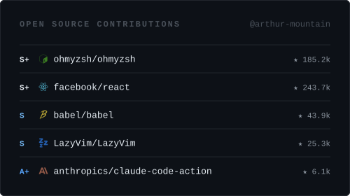

# Software Engineer | Full-Stack + Devops | Systems Thinker | Open Source | Taiwan 🇹🇼

Software engineer with a full-stack background — frontend infrastructure,
backend services, CI/CD pipelines, cloud infrastructure and AI systems.

But what drives me is going deeper. I'm drawn to the boundaries most engineers
stop at — compilers, bundler internals, networking primitives, and the Unix toolchain —
because understanding the layers below the abstractions we build on is
what makes architecture decisions defensible.

I follow and contribute to open-source projects — especially ones where
reading the source is the best documentation.

Currently pushing deeper into systems-level programming.

## Contributed

<!--
### Leetcode

| Contributed | Leetcode |
| ----------- | -------- | 
|  | 
-->

## Languages

<!--
v1 skill icons ui

-->

<!--

-->

<!--
Icon and color -> https://simpleicons.org
Custom icons -> https://shields.io/docs/logos#custom-logos

 

-->

## Frontend Skills

### Frameworks & Styling

### Performance & SEO

### Tooling & Monorepo

## Backend Skills

### Frameworks

<!--  -->

### Database & Caching

## Mobile Skills

### Cross-Platform Development

## DevOps Skills

### Infrastructure & Cloud

### CI/CD & Automation & ChatOps

### Observability & Monitoring

## Development Tools & Agentic AI

### Agentic AI

### Terminal-Centric Workflow

## Collaboration Tools

## Analytics

<!-- ### 📫 How to reach me: -->
